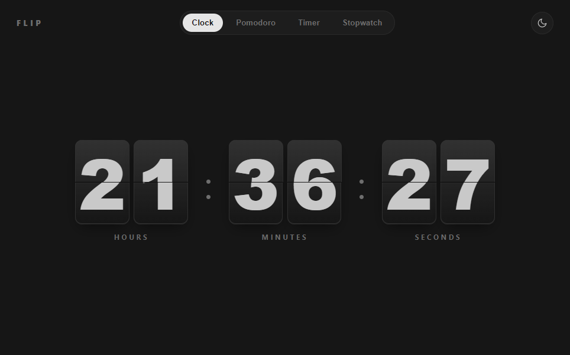
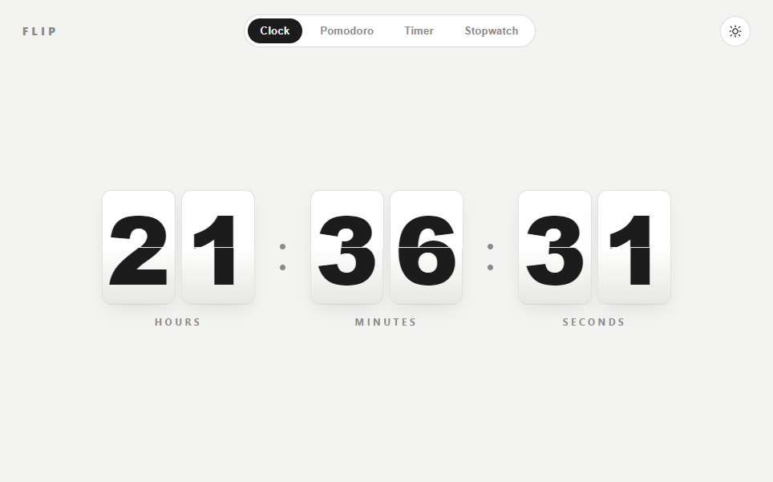
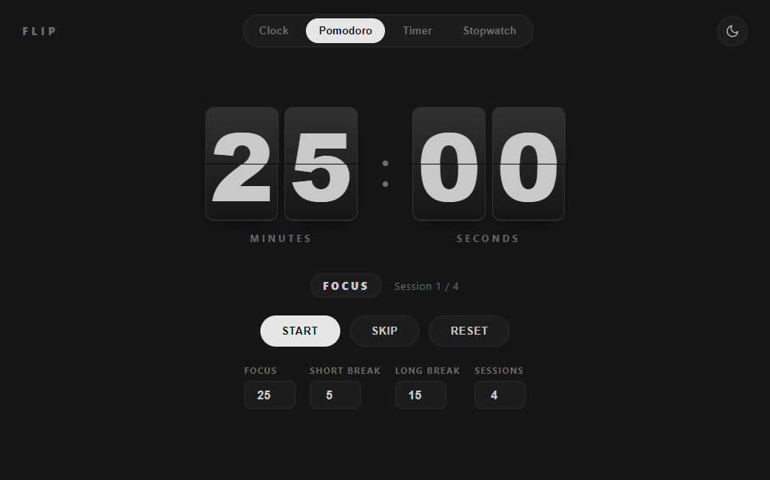
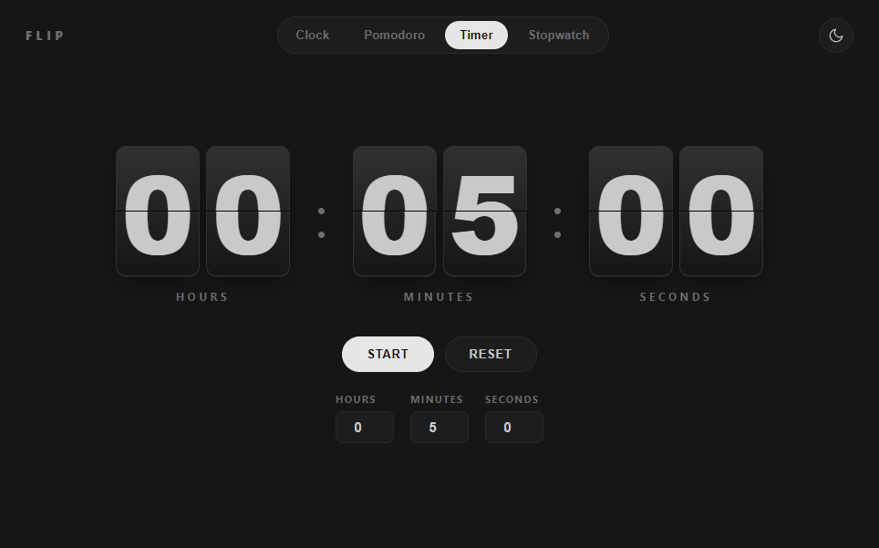
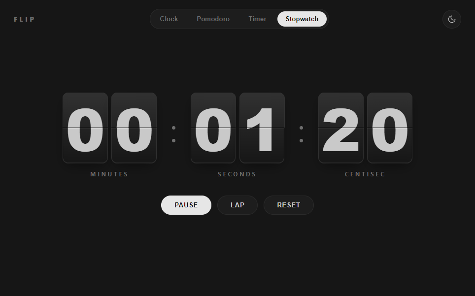

# Flip Clock

A minimalist, split-flap style desktop clock with a Pomodoro timer, countdown timer, and stopwatch — built with Electron. Light and dark themes, no ads, no accounts, no internet required.

## Preview

| Clock (dark) | Clock (light) |
| --- | --- |
|  |  |

| Pomodoro | Timer | Stopwatch |
| --- | --- | --- |
|  |  |  |

## Features

- **Clock** — live split-flap clock (hours / minutes / seconds)
- **Pomodoro** — focus / short break / long break cycle, fully configurable lengths and session count
- **Timer** — countdown from any hours/minutes/seconds
- **Stopwatch** — with lap tracking
- Flip-card animation on every digit change (seconds count up plainly, no flip, to stay readable)
- Light / dark theme toggle, persisted across launches
- Sound cue when a Pomodoro phase or timer finishes

## Install

Grab the latest installer from [Releases](../../releases), or build it yourself (see below). Run `Flip Clock Setup x.x.x.exe` and follow the installer.

> The app isn't code-signed, so Windows SmartScreen may warn about an unrecognized publisher on first run — click **More info > Run anyway**.

## Run from source

```bash
npm install
npm start
```

## Build the Windows installer

```bash
npm install
npm run dist
```

The installer is written to `dist/`.

## Tech

Electron + vanilla HTML/CSS/JS — no frameworks, no build step for the renderer.

## License

MIT
